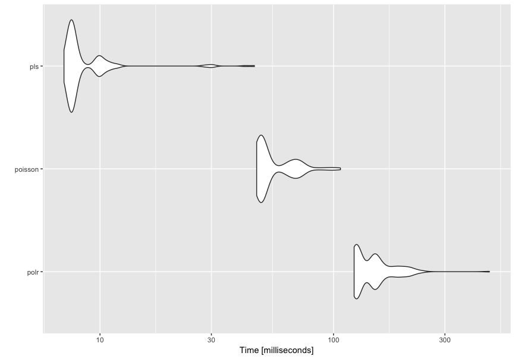
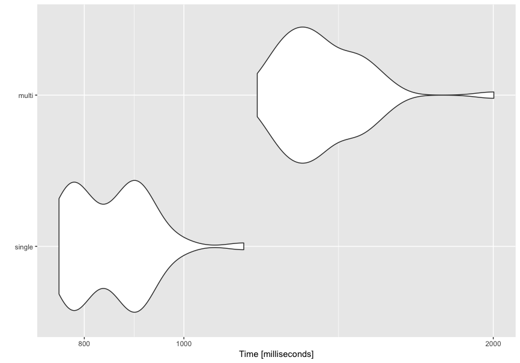
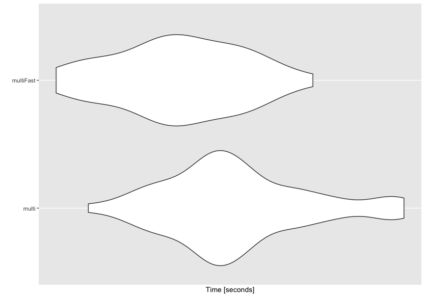
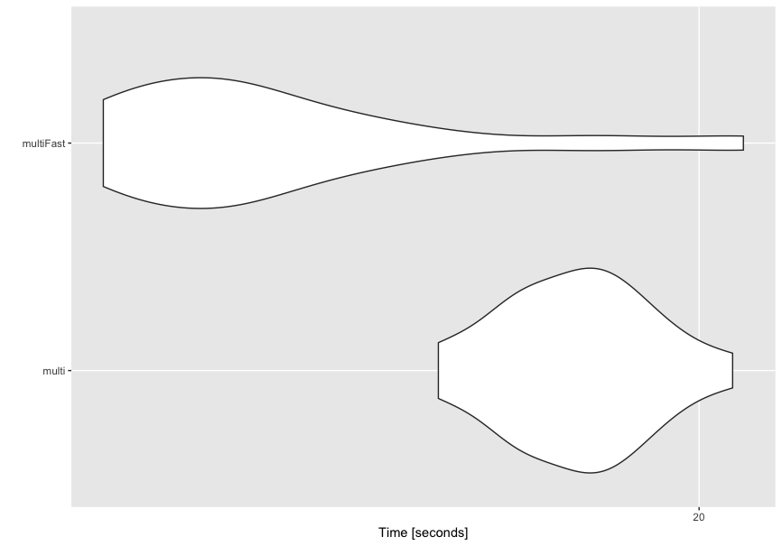
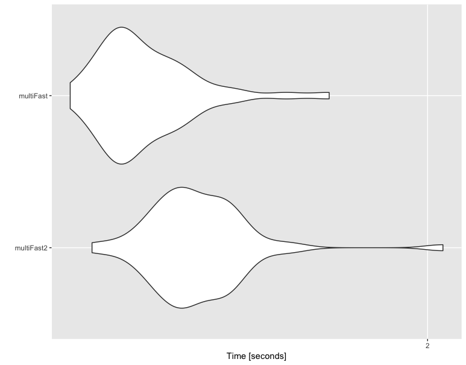
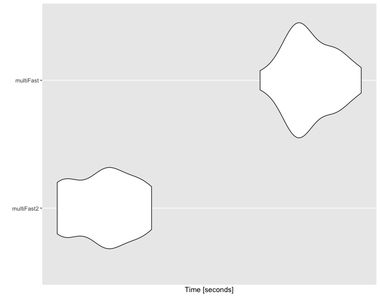

## Test des performances sur le jeux de données bordeaux (Qualité pour glm, température pour le reste)

Unit: milliseconds

|expr|        min|         lq|       mean|     median|        uq|       max|
|----|-----------|-----------|-----------|-----------|----------|----------|
|polr| 122.559078| 125.493234| 150.261750| 147.028672| 157.50174| 465.13368|
|poisson|  46.882535|  48.626915|  56.368827|  49.498429|  64.71539| 107.12152|
|pls|   7.012132|   7.436828|   9.065606|   7.686204|   8.90115|  45.85319|




## Test des performances pour différents jeux de données(GLM logistic)

Taille d'Aze : 104*34 variables

```R
microbenchmark(
+   single = plsRglm(yaze, Xaze,nt=10,modele="pls-glm-logistic",pvals.expli=T,verbose=F),
+   multi = plsRglmPar(yaze, Xaze,nt=10,modele="pls-glm-logistic",pvals.expli=T,verbose=F),
+   times=50)
```

### taille = 1 Aze

Unit: milliseconds

|   expr |      min|        lq|      mean|    median|        uq|       max| neval|
|--------|---------|----------|----------|----------|----------|----------|------|
| single | 755.9307|  786.7887|  853.3339|  865.6824|  900.4021| 1143.570 |    50|
|  multi |1178.6416| 1273.7029| 1367.7406| 1335.6206| 1459.3418| 2002.678 |    50|



### taille = 100 Aze

Unit: seconds

|   expr|      min|       lq|     mean|   median|       uq|      max| neval|
|-------|---------|---------|---------|---------|---------|---------|------|
| single| 25.57291| 25.64467| 25.85495| 25.72257| 25.93241| 26.96713|    20|
|  multi| 19.62857| 20.11816| 20.83233| 20.65258| 21.12395| 24.51206|    20|


## Fastglm vs glm (Aze GLM logistic)

### taill = 1 aze
Unit: seconds

|      expr|      min|       lq|     mean|   median|       uq|      max| neval|
|----------|---------|---------|---------|---------|---------|---------|------|
|     multi| 1.144857| 1.274948| 1.325466| 1.307239| 1.363580| 1.560378|    50|
| multiFast| 1.109311| 1.205085| 1.253552| 1.250260| 1.311317| 1.426883|    50|



### taille = 100 Aze

Unit: seconds

|      expr|      min|       lq|     mean|   median|       uq|      max| neval|
|----------|---------|---------|---------|---------|---------|---------|------|
|     multi| 17.99874| 18.59391| 19.03703| 19.09620| 19.41044| 20.27305|    20|
| multiFast| 15.71824| 16.04761| 16.87588| 16.56986| 17.30928| 20.36159|    20|




## foreach sur ttPredictY

### taille = 1 aze

Unit: seconds

|       expr|      min|       lq|     mean|   median|       uq|      max| neval|
|-----------|---------|---------|---------|---------|---------|---------|------|
| multiFast2| 1.165617| 1.313193| 1.387126| 1.361401| 1.444236| 2.050066|    50|
|  multiFast| 1.125387| 1.203078| 1.274719| 1.241205| 1.322504| 1.707173|    50|



### taille = 100 aze
Unit: seconds

|       expr|      min|       lq|     mean|   median|       uq|     max| neval|
|-----------|---------|---------|---------|---------|---------|--------|------|
| multiFast2| 13.81966| 13.92595| 14.18017| 14.19904| 14.39000| 14.5635|    20|
|  multiFast| 15.46839| 15.74820| 15.90470| 15.85190| 16.10824| 16.3625|    20|


