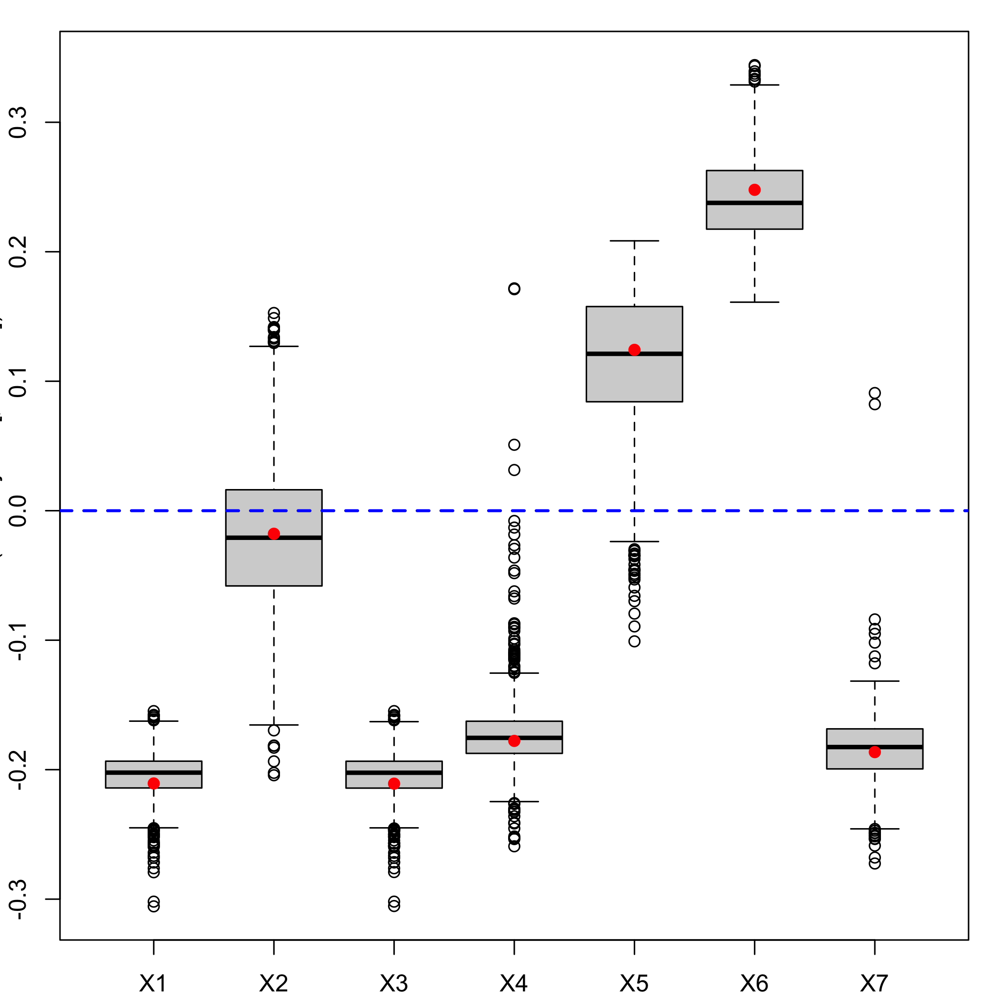
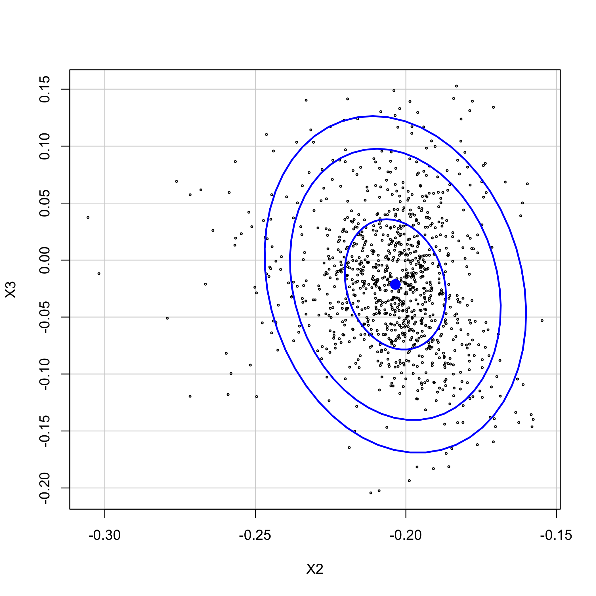
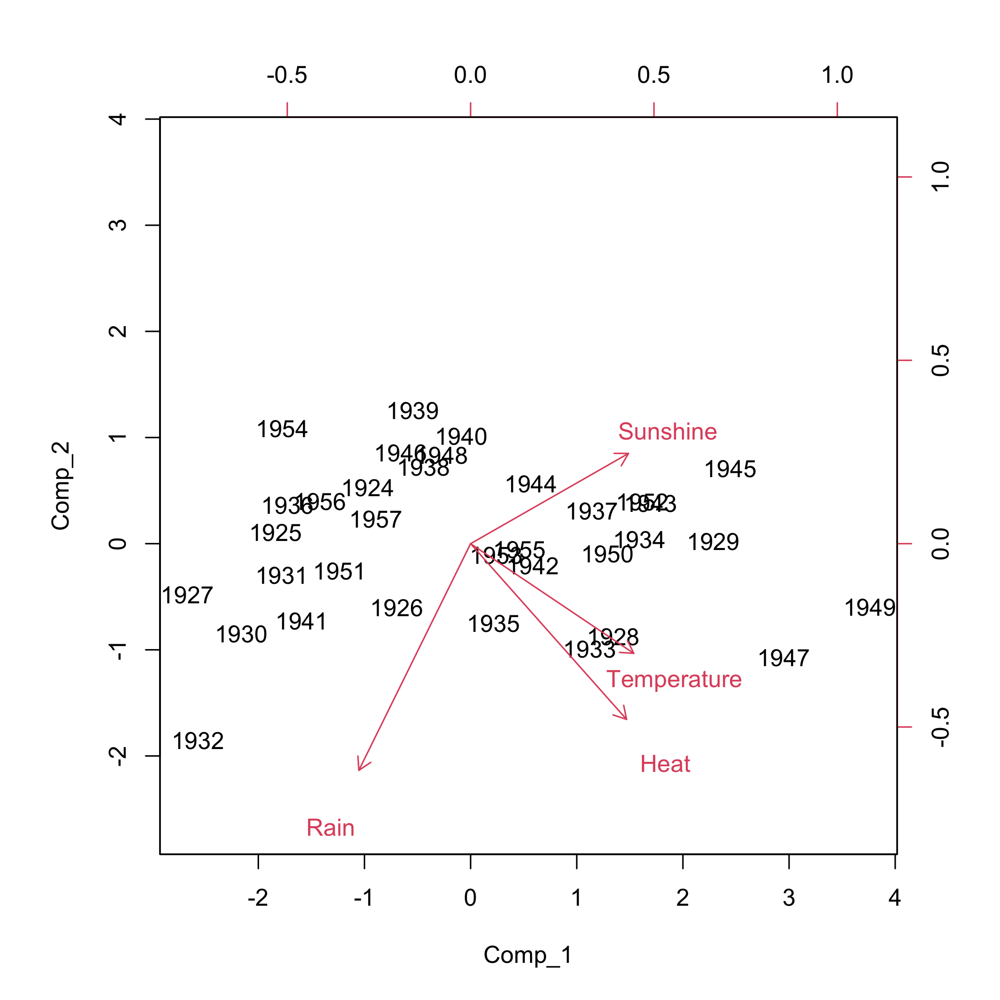
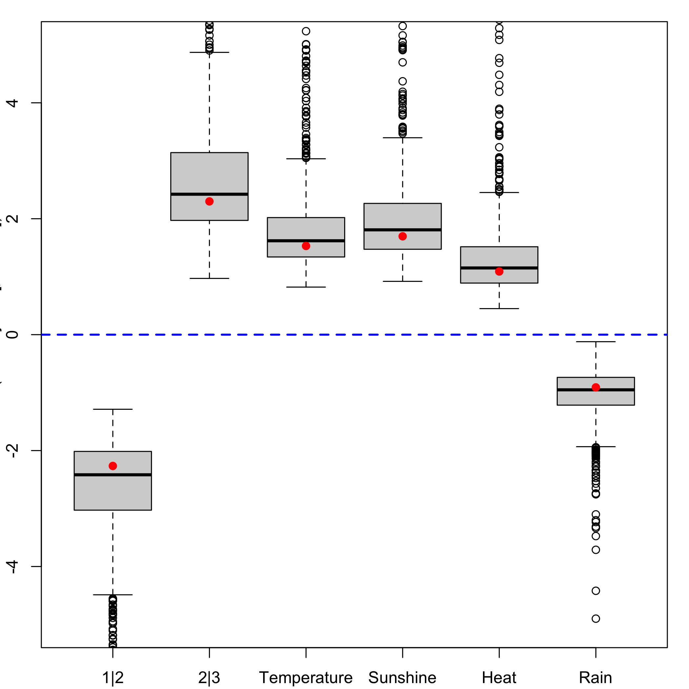
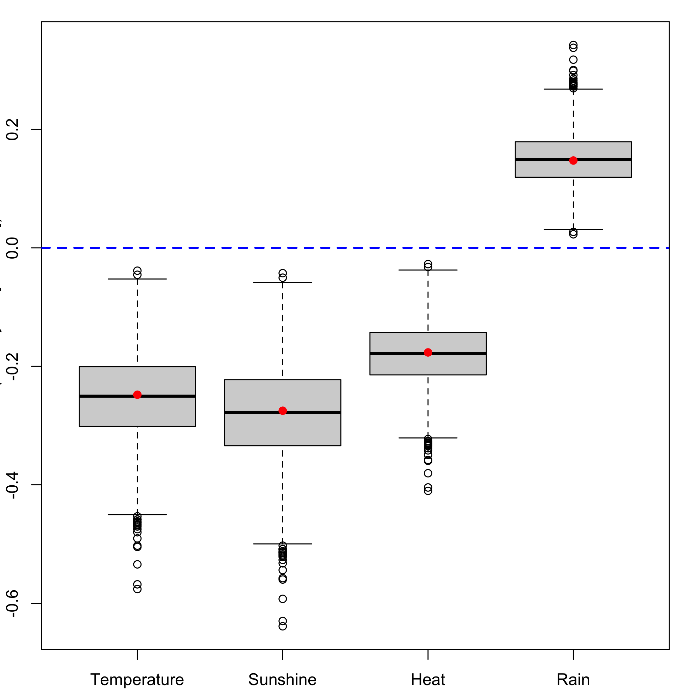
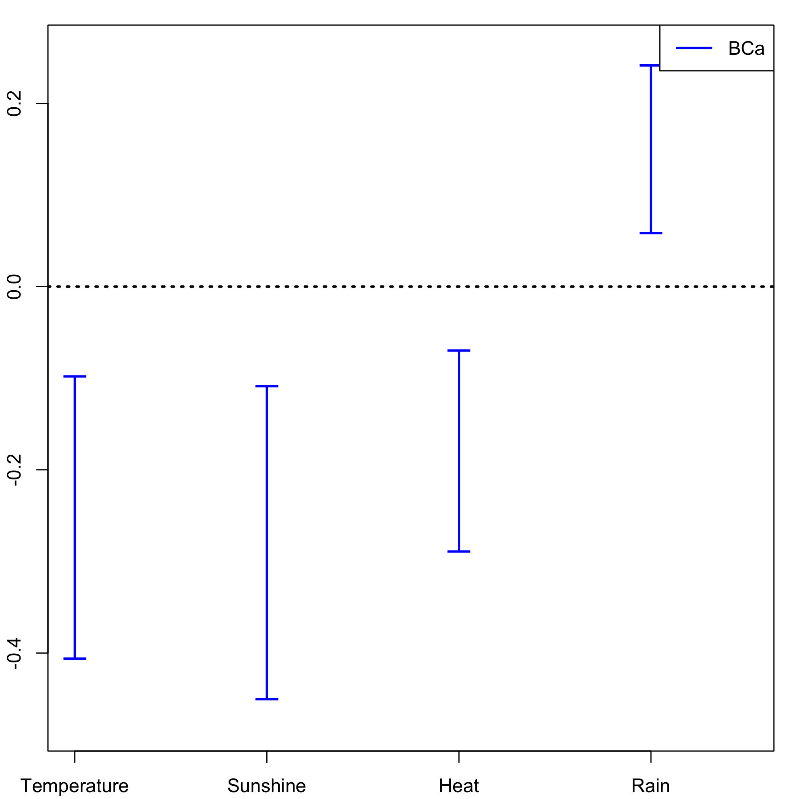

[](https://cran.r-project.org/package=plsRglm)

<!-- README.md is generated from README.Rmd. Please edit that file -->


# plsRglm

The goal of plsRglm [<arXiv:1810.0100>](https://arxiv.org/abs/1810.01005) is to provide (weighted) Partial least squares Regression for generalized linear models and repeated k-fold cross-validation of such models using various criteria. It allows for missing data in the explanatory variables. Bootstrap confidence intervals constructions are also available.


Partial least squares Regression for generalized linear models were introduced in 
Bastien, P., Vinzi, V. E. et Tenenhaus, M. (2005). "PLS generalised linear
regression". *Computational Statistics & Data Analysis*, **48**(1), 17–46, <http://www.sciencedirect.com/science/article/pii/S0167947304000271>.


The package was first developped for the article, written in French, Nicolas Meyer, Myriam Maumy-Bertrand and Frédéric Bertrand (2010), "Comparaison de la régression PLS et de la régression logistique PLS : application aux données d'allélotypage", *Journal de la Société Française de Statistique*, **151**(2), pages 1-18,
<http://journal-sfds.fr/article/view/47>.


The package was presented at the [User2014!](http://user2014.r-project.org/) conference. Frédéric Bertrand, Jérémy Magnanensi, Nicolas Meyer and Myriam Bertrand (2014). "plsRglm, PLS generalized linear models for R", *book of abstracts*, User2014!, Los Angeles, page 150,
<http://user2014.r-project.org/abstracts/posters/172_Bertrand.pdf>.


For more involved number of component selection techniques, see "A new universal resample-stable bootstrap-based stopping criterion for PLS component construction"", Jérémy Magnanensi, Frédéric Bertrand, Myriam Maumy-Bertrand and Nicolas Meyer, *Statistics and Computing* (2017) **27**:757–774, <https://doi.org/10.1007/s11222-016-9651-4>. The new methods presented in that article will be packaged soon.


A short paper that sums up some of features of the package is available on [arxiv](https://arxiv.org/), Frédéric Bertrand and Myriam Maumy-Bertrand (2018), "plsRglm: Partial least squares linear and generalized linear regression for processing incomplete datasets by cross-validation and bootstrap techniques with R", *arxiv*, [<arXiv:1810.0100>](https://arxiv.org/abs/1810.01005).


A [vignette](https://cran.r-project.org/web/packages/plsRglm/vignettes/plsRglm.pdf) is available for the package "plsRglm: Algorithmic insights and applications".


The plsRglm package contains some interesting datasets including:

* the Cornell dataset from Kettaneh-Wold, "Analysis of mixture data with partial least squares", *Chemometrics and Intelligent Laboratory Systems*, **14**(1):57–69, 1992,
* a study on the pine processionary caterpillars from R. Tomassone, S. Audrain, E. Lesquoy-de Turckeim, and C. Millier, "La régression, nouveaux regards sur une ancienne méethode statistique", *Actualitées scientifiques et agronomiques*, Masson, Paris, 1992,
* an allelotyping study on cancer cells dataset with missing values from N. Meyer, M. Maumy-Bertrand, and F. Bertrand, "Comparaison de variantes de régressions logistiques pls et de régression pls sur variables qualitatives: application aux donnéees d’allélotypage". *Journal de la Sociéetée Franç̧aise de Statistique*, **151**(2):1–18, 2010, 
* a Bordeaux wines quality study, M. Tenenhaus. "La régression logistique PLS". In J.-J. Droesbeke, M. Lejeune, and G. Saporta, editors, *Modèles statistiques pour donnéees qualitatives*, Éditions Technip, Paris, 2005.
 
 
The package was also applied to the Phenyl and Hyptis datasets from the [chemometrics](https://CRAN.R-project.org/package=chemometrics) and the colonCA dataset from the [colonCA](http://bioconductor.org/packages/release/bioc/html/colonCA.html) package.


Support for parallel computation and GPU is being developped.


## Installation

You can install the released version of plsRglm from [CRAN](https://CRAN.R-project.org) with:


```r
install.packages("plsRglm")
```

You can install the development version of plsRglm from [github](https://github.com) with:


```r
devtools::install_github("fbertran/plsRglm")
```

## Example for regular PLS regression: Cornell

Read the [vignette of the package](https://cran.r-project.org/web/packages/plsRglm/vignettes/plsRglm.pdf) for algorithmic insights and more examples.

### Cross validation


```r
library(plsRglm)
data(Cornell)
```

We use k = 6 balanced groups of 2 subjects to perform repeated k-fold cross validation. We set to 10, thanks to the option nt=6, the maximal number of components for the cross-validation function -cv.plsR- since the rank of the design matrix is equal to 6. The grouplist option enables the user to provide custom splits of the datasets on which cross validation will be carried out. As a consequence, one can use the [caret](http://bioconductor.org/packages/release/bioc/html/caret.html) (from Max Kuhn et al., 2019) package to find balanced splits of the dataset into folds with respect to the response values.


```r
cv.modpls<-cv.plsR(Y~.,data=Cornell,nt=6,K=6)
#> NK: 1 
#> Number of groups : 6 
#> 1 
#> ____************************************************____
#> ____Predicting X without NA neither in X nor in Y____
#> ____Component____ 1 ____
#> ____Component____ 2 ____
#> ____Component____ 3 ____
#> ____Component____ 4 ____
#> ____Component____ 5 ____
#> ____Component____ 6 ____
#> ****________________________________________________****
#> 
#> 2 
#> ____************************************************____
#> ____Predicting X without NA neither in X nor in Y____
#> ____Component____ 1 ____
#> ____Component____ 2 ____
#> ____Component____ 3 ____
#> ____Component____ 4 ____
#> ____Component____ 5 ____
#> ____Component____ 6 ____
#> ****________________________________________________****
#> 
#> 3 
#> ____************************************************____
#> ____Predicting X without NA neither in X nor in Y____
#> ____Component____ 1 ____
#> ____Component____ 2 ____
#> ____Component____ 3 ____
#> ____Component____ 4 ____
#> ____Component____ 5 ____
#> Warning : 1 2 3 4 5 6 7 < 10^{-12}
#> Warning only 5 components could thus be extracted
#> ****________________________________________________****
#> 
#> 4 
#> ____************************************************____
#> ____Predicting X without NA neither in X nor in Y____
#> ____Component____ 1 ____
#> ____Component____ 2 ____
#> ____Component____ 3 ____
#> ____Component____ 4 ____
#> ____Component____ 5 ____
#> ____Component____ 6 ____
#> ****________________________________________________****
#> 
#> 5 
#> ____************************************************____
#> ____Predicting X without NA neither in X nor in Y____
#> ____Component____ 1 ____
#> ____Component____ 2 ____
#> ____Component____ 3 ____
#> ____Component____ 4 ____
#> ____Component____ 5 ____
#> ____Component____ 6 ____
#> ****________________________________________________****
#> 
#> 6 
#> ____************************************************____
#> ____Predicting X without NA neither in X nor in Y____
#> ____Component____ 1 ____
#> ____Component____ 2 ____
#> ____Component____ 3 ____
#> ____Component____ 4 ____
#> ____Component____ 5 ____
#> ____Component____ 6 ____
#> ****________________________________________________****
```

We sum up the results in a single table using the summary.


```r
res.cv.modpls<-cvtable(summary(cv.modpls))
#> ____************************************************____
#> ____Component____ 1 ____
#> ____Component____ 2 ____
#> ____Component____ 3 ____
#> ____Component____ 4 ____
#> ____Component____ 5 ____
#> ____Component____ 6 ____
#> ____Predicting X without NA neither in X nor in Y____
#> Loading required namespace: plsdof
#> ****________________________________________________****
#> 
#> 
#> NK: 1
#> 
#> CV Q2 criterion:
#> 0 1 
#> 0 1 
#> 
#> CV Press criterion:
#> 1 2 3 4 5 
#> 0 0 0 0 1
```

You can perform leave one out cross validation similar to the one that existed in previous versions of SIMCA by setting TypeVC="standard". Two other options, TypeVC="missing" or TypeVC="standard", exists to handle incomplete datasets. Indeed, of cross validation is required is that case, one needs to selects the way of predicting the response for left out observations. For complete rows, without any missing value, there are two different ways of computing these predictions. As a consequence, for mixed datasets, with complete and incomplete rows, there are two ways of computing prediction : either predicts any row as if there were missing values in it (missingdata) or selects the prediction method accordingly to the completeness of the row (adaptative).


```r
res6<-plsR(Y~.,data=Cornell, nt=6, typeVC="standard", pvals.expli=TRUE)
#> ____************************************************____
#> ____TypeVC____ standard ____
#> ____Component____ 1 ____
#> ____Component____ 2 ____
#> ____Component____ 3 ____
#> ____Component____ 4 ____
#> ____Component____ 5 ____
#> ____Component____ 6 ____
#> ____Predicting X without NA neither in X nor in Y____
#> ****________________________________________________****
```


```r
colSums(res6$pvalstep)
#> [1] 0 0 3 0 0 0
```


```r
res6$InfCrit
#>                AIC   Q2cum_Y LimQ2_Y        Q2_Y   PRESS_Y      RSS_Y
#> Nb_Comp_0 82.01205        NA      NA          NA        NA 467.796667
#> Nb_Comp_1 53.15173 0.8966556  0.0975  0.89665563 48.344150  35.742486
#> Nb_Comp_2 41.08283 0.9175426  0.0975  0.20210989 28.518576  11.066606
#> Nb_Comp_3 32.06411 0.9399676  0.0975  0.27195907  8.056942   4.418081
#> Nb_Comp_4 33.76477 0.9197009  0.0975 -0.33759604  5.909608   4.309235
#> Nb_Comp_5 33.34373 0.9281373  0.0975  0.10506161  3.856500   3.521924
#> Nb_Comp_6 35.25533 0.9232562  0.0975 -0.06792167  3.761138   3.496074
#>                R2_Y R2_residY  RSS_residY PRESS_residY   Q2_residY  LimQ2
#> Nb_Comp_0        NA        NA 11.00000000           NA          NA     NA
#> Nb_Comp_1 0.9235940 0.9235940  0.84046633   1.13678803  0.89665563 0.0975
#> Nb_Comp_2 0.9763431 0.9763431  0.26022559   0.67059977  0.20210989 0.0975
#> Nb_Comp_3 0.9905556 0.9905556  0.10388893   0.18945488  0.27195907 0.0975
#> Nb_Comp_4 0.9907882 0.9907882  0.10132947   0.13896142 -0.33759604 0.0975
#> Nb_Comp_5 0.9924713 0.9924713  0.08281624   0.09068364  0.10506161 0.0975
#> Nb_Comp_6 0.9925265 0.9925265  0.08220840   0.08844125 -0.06792167 0.0975
#>           Q2cum_residY    AIC.std  DoF.dof sigmahat.dof    AIC.dof
#> Nb_Comp_0           NA  37.010388 1.000000    6.5212706 46.0708838
#> Nb_Comp_1    0.8966556   8.150064 2.740749    1.8665281  4.5699686
#> Nb_Comp_2    0.9175426  -3.918831 5.085967    1.1825195  2.1075461
#> Nb_Comp_3    0.9399676 -12.937550 5.121086    0.7488308  0.8467795
#> Nb_Comp_4    0.9197009 -11.236891 5.103312    0.7387162  0.8232505
#> Nb_Comp_5    0.9281373 -11.657929 6.006316    0.7096382  0.7976101
#> Nb_Comp_6    0.9232562  -9.746328 7.000002    0.7633343  0.9711322
#>              BIC.dof GMDL.dof DoF.naive sigmahat.naive  AIC.naive
#> Nb_Comp_0 47.7893514 27.59461         1      6.5212706 46.0708838
#> Nb_Comp_1  4.9558156 21.34020         2      1.8905683  4.1699567
#> Nb_Comp_2  2.3949331 27.40202         3      1.1088836  1.5370286
#> Nb_Comp_3  0.9628191 24.40842         4      0.7431421  0.7363469
#> Nb_Comp_4  0.9357846 24.23105         5      0.7846050  0.8721072
#> Nb_Comp_5  0.9198348 28.21184         6      0.7661509  0.8804809
#> Nb_Comp_6  1.1359501 33.18348         7      0.8361907  1.1070902
#>            BIC.naive GMDL.naive
#> Nb_Comp_0 47.7893514   27.59461
#> Nb_Comp_1  4.4588195   18.37545
#> Nb_Comp_2  1.6860917   17.71117
#> Nb_Comp_3  0.8256118   19.01033
#> Nb_Comp_4  0.9964867   24.16510
#> Nb_Comp_5  1.0227979   28.64206
#> Nb_Comp_6  1.3048716   33.63927
```

The number of significant predictors per components, which is a criteria of significance for [Bastien et al. (2005)](http://www.sciencedirect.com/science/article/pii/S0167947304000271), can be obtained via the following code:


```r
res6<-plsR(Y~.,data=Cornell, nt=6, pvals.expli=TRUE)
#> ____************************************************____
#> ____Component____ 1 ____
#> ____Component____ 2 ____
#> ____Component____ 3 ____
#> ____Component____ 4 ____
#> ____Component____ 5 ____
#> ____Component____ 6 ____
#> ____Predicting X without NA neither in X nor in Y____
#> ****________________________________________________****
```


```r
colSums(res6$pvalstep)
#> [1] 0 0 3 0 0 0
```

The number of significant predictors within each component tell us to only build 3 components when the AIC criteria gives us 5 components and the BIC concludes to 5 components. The cross-validated Q2cum criterion advocates for retaining 3 components either for leave one out and 1 for 6-fold CV. The 6-fold CV cross-validation was run 100 times by randomly creating groups. Here are the command lines:


```r
set.seed(123)
cv.modpls<-cv.plsR(Y~.,data=Cornell,nt=6,K=6,NK=100,random=TRUE,verbose = FALSE)
```

Analyze the results of the cross-validation.

```r
res.cv.modpls=cvtable(summary(cv.modpls))
#> ____************************************************____
#> ____Component____ 1 ____
#> ____Component____ 2 ____
#> ____Component____ 3 ____
#> ____Component____ 4 ____
#> ____Component____ 5 ____
#> ____Component____ 6 ____
#> ____Predicting X without NA neither in X nor in Y____
#> ****________________________________________________****
#> 
#> 
#> NK: 1,  2,  3,  4,  5,  6,  7,  8,  9,  10
#> NK: 11,  12,  13,  14,  15,  16,  17,  18,  19,  20
#> NK: 21,  22,  23,  24,  25,  26,  27,  28,  29,  30
#> NK: 31,  32,  33,  34,  35,  36,  37,  38,  39,  40
#> NK: 41,  42,  43,  44,  45,  46,  47,  48,  49,  50
#> NK: 51,  52,  53,  54,  55,  56,  57,  58,  59,  60
#> NK: 61,  62,  63,  64,  65,  66,  67,  68,  69,  70
#> NK: 71,  72,  73,  74,  75,  76,  77,  78,  79,  80
#> NK: 81,  82,  83,  84,  85,  86,  87,  88,  89,  90
#> NK: 91,  92,  93,  94,  95,  96,  97,  98,  99,  100
#> 
#> CV Q2 criterion:
#>  0  1  2 
#>  0 89 11 
#> 
#> CV Press criterion:
#>  1  2  3  4  5 
#>  0  0 33 55 12
```

Plot the results of the cross-validation.

```r
plot(res.cv.modpls)
```


The results of the cross-validation, using of the Q^2 criterion, confirm those of the first 6-fold CV cross validation: we decide to retain 1 components. Even in the linear case, cross validation should be repeated to select the number of components in a PLSR model.

Now, we fit the PLSGLR regression with one component to get the $c_h$ coefficients and the intercept.


```r
res<-plsR(Y~.,data=Cornell,nt=1,pvals.expli=TRUE)
#> ____************************************************____
#> ____Component____ 1 ____
#> ____Predicting X without NA neither in X nor in Y____
#> ****________________________________________________****
```


```r
res
#> Number of required components:
#> [1] 1
#> Number of successfully computed components:
#> [1] 1
#> Coefficients:
#>                  [,1]
#> Intercept  92.4321920
#> X1        -14.8845522
#> X2         -0.5942086
#> X3        -25.5423703
#> X4         -5.1075228
#> X5         14.1877035
#> X6          5.5177190
#> X7        -44.9000310
#> Information criteria and Fit statistics:
#>                AIC     RSS_Y     R2_Y R2_residY RSS_residY   AIC.std
#> Nb_Comp_0 82.01205 467.79667       NA        NA 11.0000000 37.010388
#> Nb_Comp_1 53.15173  35.74249 0.923594  0.923594  0.8404663  8.150064
#>            DoF.dof sigmahat.dof   AIC.dof   BIC.dof GMDL.dof DoF.naive
#> Nb_Comp_0 1.000000     6.521271 46.070884 47.789351 27.59461         1
#> Nb_Comp_1 2.740749     1.866528  4.569969  4.955816 21.34020         2
#>           sigmahat.naive AIC.naive BIC.naive GMDL.naive
#> Nb_Comp_0       6.521271 46.070884  47.78935   27.59461
#> Nb_Comp_1       1.890568  4.169957   4.45882   18.37545
```

It is also possible to obtain the matrix W∗ with the following command line:


```r
res$wwetoile
#>    Coord_Comp_1
#> X1  -0.43699629
#> X2  -0.03696135
#> X3  -0.43734182
#> X4  -0.36884361
#> X5   0.25772058
#> X6   0.51412193
#> X7  -0.38679886
```

It is also possible to display the biplot of the observations and the predictors. 


```r
biplot(res6$tt,res6$pp)
```


Hard thresholding PLS regression and automatic selection of the number of components ([Bastien et al. (2005)](http://www.sciencedirect.com/science/article/pii/S0167947304000271)) is also available:


```r
modpls2 <- plsR(Y~.,data=Cornell,6,sparse=TRUE)
#> ____************************************************____
#> No significant predictors (<0.05) found
#> Warning only one standard component (without sparse option) was thus extracted
#> ____Component____ 1 ____
#> ____Predicting X without NA neither in X nor in Y____
#> ****________________________________________________****
```


```r
modpls3 <- plsR(Y~.,data=Cornell,6,sparse=TRUE,sparseStop=FALSE)
#> ____************************************************____
#> No significant predictors (<0.05) found
#> Warning only one standard component (without sparse option) was thus extracted
#> ____Component____ 1 ____
#> ____Predicting X without NA neither in X nor in Y____
#> ****________________________________________________****
```

### Bootstrap (y,X)


```r
set.seed(123)
Cornell.bootYX1=bootpls(res,R=1000,verbose=FALSE)
```

We do not bootstrap the intercept since the boostrap is done with the centered and scaled response and predictors. As a consequence we should exclude it from the boxplots using the option indice=2:8 and must exclude it from the CI computations, if we request BCa ones, again with the option indice=2:8.

Graphical results of the bootstrap on the (Y,X): distributions of the estimators.

```r
boxplots.bootpls(Cornell.bootYX1,indice=2:8)
```



Graphical results of the bootstrap on the (Y,X): confidence intervals

```r
temp.ci=confints.bootpls(Cornell.bootYX1,indice=2:8)
plots.confints.bootpls(temp.ci,typeIC="BCa",colIC=c("blue","blue","blue","blue"), legendpos ="topright")
```


                   
Bootstrap is perfomed using the boot package. It allows the user to apply the functions, including jack.after.boot or plot.boot, of this package to the bootstrapped PLSR or PLSGLR models.


```r
plot(Cornell.bootYX1,index=2,jack=TRUE)
```


Using the dataEllipse of the car you can plot confidence ellipses for two parameters of the PLSR or PLSGLR models.


```r
car::dataEllipse(Cornell.bootYX1$t[,2], Cornell.bootYX1$t[,3], cex=.3, levels=c(.5, .95, .99), robust=T, xlab="X2", ylab="X3")
```



###Bootstrap (y, T)

Re-sampling on the couple (Y,T) ([Bastien et al. (2005)](http://www.sciencedirect.com/science/article/pii/S0167947304000271)) is more stable and faster than the first one. We set at 1000 the number of re-sampling.


```r
set.seed(123)
Cornell.bootYT1=bootpls(res,typeboot="fmodel_np",R=1000)
```

Boxplots for each of the predictors.

```r
boxplots.bootpls(Cornell.bootYT1,indices=2:8)
```


We do not bootstrap the intercept since the boostrap is done with the centered and scaled response and predictors. As a consequence we should exclude it from the boxplots using the option indice=2:8 and must exclude it from the CI computations, if we request BCa ones, again with the option indice=2:8.

CIs for each of the predictors.

```r
temp.ci=confints.bootpls(Cornell.bootYT1,indices=2:8)
plots.confints.bootpls(temp.ci,typeIC="BCa",colIC=c("blue","blue","blue","blue"), legendpos ="topright")
```


Since after cross validation we an empirical distribution of the retained number of components, it makes sense to perform (y,T) bootstrap for any of these numbers of components and compare the resulting significance of the predictors at a 5% level. The signpred function can be used to plot a summary of this selection.

In addition, one can compute an empirical measure of significance $\pi_e$ by computing the weighted -with respect to the empirical distribution of components- average of the significance indicatrices. In that case, all the predictors are significant for the 1 and 2 components model and hence the empirical mesure of significance is equal to 1 for all of them.


```r
res2<-plsR(Y~.,data=Cornell,nt=2)
#> ____************************************************____
#> ____Component____ 1 ____
#> ____Component____ 2 ____
#> ____Predicting X without NA neither in X nor in Y____
#> ****________________________________________________****
```


```r
Cornell.bootYT2=bootpls(res2,typeboot="fmodel_np",R=1000)
temp.ci2<-confints.bootpls(Cornell.bootYT2,indices=2:8)
```


```r
ind.BCa.CornellYT1 <- (temp.ci[,7]<0&temp.ci[,8]<0)|(temp.ci[,7]>0&temp.ci[,8]>0)
```


```r
ind.BCa.CornellYT2 <- (temp.ci2[,7]<0&temp.ci2[,8]<0)|(temp.ci2[,7]>0&temp.ci2[,8]>0)
```


```r
(matind=(rbind(YT1=ind.BCa.CornellYT1,YT2=ind.BCa.CornellYT2)))
#>       X1   X2   X3   X4    X5   X6   X7
#> YT1 TRUE TRUE TRUE TRUE  TRUE TRUE TRUE
#> YT2 TRUE TRUE TRUE TRUE FALSE TRUE TRUE
```

Compute the empirical measures of significance $\pi_e$.

```r
pi.e=prop.table(res.cv.modpls$CVQ2)[-1]%*%matind
pi.e
#>      X1 X2 X3 X4   X5 X6 X7
#> [1,]  1  1  1  1 0.89  1  1
```

The signpred function can be used to plot a summary of the variable selection.

```r
signpred(t(matind),labsize=.5, plotsize = 12)
text(1:(ncol(matind))-.5,-.5,pi.e,cex=1.4)
mtext(expression(pi[e]),side=2,las=1,line=2,at=-.5,cex=1.4)
```


## Example for PLS ordinal logistic regression: Bordeaux wine quality

### Cross-validation


```r
rm(list = ls())
set.seed(12345)
data(bordeaux)
bordeaux$Quality<-factor(bordeaux$Quality,ordered=TRUE)
modpls1 <- plsRglm(Quality~.,data=bordeaux,4,modele="pls-glm-polr",pvals.expli=TRUE)
#> ____************************************************____
#> 
#> Model: pls-glm-polr 
#> Method: logistic 
#> 
#> ____Component____ 1 ____
#> ____Component____ 2 ____
#> ____Component____ 3 ____
#> ____Component____ 4 ____
#> ____Predicting X without NA neither in X or Y____
#> ****________________________________________________****
```


```r
modpls1
#> Number of required components:
#> [1] 4
#> Number of successfully computed components:
#> [1] 4
#> Coefficients:
#>                     [,1]
#> 1|2         -85.50956454
#> 2|3         -80.55155990
#> Temperature   0.02427235
#> Sunshine      0.01379029
#> Heat         -0.08876364
#> Rain         -0.02589509
#> Information criteria and Fit statistics:
#>                AIC      BIC Missclassed Chi2_Pearson_Y
#> Nb_Comp_0 78.64736 81.70009          22      62.333333
#> Nb_Comp_1 36.50286 41.08194           6       9.356521
#> Nb_Comp_2 35.58058 41.68602           6       8.568956
#> Nb_Comp_3 36.26588 43.89768           7       8.281011
#> Nb_Comp_4 38.15799 47.31616           7       8.321689
```


```r
Xbordeaux<-bordeaux[,1:4]
ybordeaux<-bordeaux$Quality
modpls2 <- plsRglm(ybordeaux,Xbordeaux,4,modele="pls-glm-polr",pvals.expli=TRUE)
#> ____************************************************____
#> 
#> Model: pls-glm-polr 
#> Method: logistic 
#> 
#> ____Component____ 1 ____
#> ____Component____ 2 ____
#> ____Component____ 3 ____
#> ____Component____ 4 ____
#> ____Predicting X without NA neither in X nor in Y____
#> ****________________________________________________****
```


```r
modpls2
#> Number of required components:
#> [1] 4
#> Number of successfully computed components:
#> [1] 4
#> Coefficients:
#>                     [,1]
#> 1|2         -85.50956454
#> 2|3         -80.55155990
#> Temperature   0.02427235
#> Sunshine      0.01379029
#> Heat         -0.08876364
#> Rain         -0.02589509
#> Information criteria and Fit statistics:
#>                AIC      BIC Missclassed Chi2_Pearson_Y
#> Nb_Comp_0 78.64736 81.70009          22      62.333333
#> Nb_Comp_1 36.50286 41.08194           6       9.356521
#> Nb_Comp_2 35.58058 41.68602           6       8.568956
#> Nb_Comp_3 36.26588 43.89768           7       8.281011
#> Nb_Comp_4 38.15799 47.31616           7       8.321689
```


```r
all(modpls1$InfCrit==modpls2$InfCrit)
#> [1] TRUE
```


```r
colSums(modpls2$pvalstep)
#> temppvalstep temppvalstep temppvalstep temppvalstep 
#>            4            0            0            0
```

No discrepancy between formula specification (formula and data) and datasets (dataY and dataX) ones.
Number of components to be retained:
* AIC -> 2.
* BIC -> 1.
* Non cross validated missclassed -> 1.
* Non significant predictor criterion -> 1.


```r
set.seed(123)
cv.modpls<-cv.plsRglm(ybordeaux,Xbordeaux,nt=4,modele="pls-glm-polr",NK=100,verbose=FALSE)
```


```r
res.cv.modpls=cvtable(summary(cv.modpls, MClassed = TRUE))
#> ____************************************************____
#> 
#> Model: pls-glm-polr 
#> Method: logistic 
#> 
#> ____Component____ 1 ____
#> ____Component____ 2 ____
#> ____Component____ 3 ____
#> ____Component____ 4 ____
#> ____Predicting X without NA neither in X nor in Y____
#> ****________________________________________________****
#> 
#> 
#> NK: 1,  2,  3,  4,  5,  6,  7,  8,  9,  10
#> NK: 11,  12,  13,  14,  15,  16,  17,  18,  19,  20
#> NK: 21,  22,  23,  24,  25,  26,  27,  28,  29,  30
#> NK: 31,  32,  33,  34,  35,  36,  37,  38,  39,  40
#> NK: 41,  42,  43,  44,  45,  46,  47,  48,  49,  50
#> NK: 51,  52,  53,  54,  55,  56,  57,  58,  59,  60
#> NK: 61,  62,  63,  64,  65,  66,  67,  68,  69,  70
#> NK: 71,  72,  73,  74,  75,  76,  77,  78,  79,  80
#> NK: 81,  82,  83,  84,  85,  86,  87,  88,  89,  90
#> NK: 91,  92,  93,  94,  95,  96,  97,  98,  99,  100
#> CV MissClassed criterion:
#>  1  2  3  4 
#> 84  7  7  2 
#> 
#> CV Q2Chi2 criterion:
#>  0  1 
#> 98  2 
#> 
#> CV PreChi2 criterion:
#>  1  2  3 
#> 24 73  3
```

According to the results of the cross validation procedure, we retain a single component, which was also, by chance on this dataset, the BIC and raw cross-validation choices.


```r
plot(res.cv.modpls)
```


Fit the model that was selected according to cross validated missclassed criterion.


```r
res<-plsRglm(ybordeaux,Xbordeaux,1,modele="pls-glm-polr")
#> ____************************************************____
#> 
#> Model: pls-glm-polr 
#> Method: logistic 
#> 
#> ____Component____ 1 ____
#> ____Predicting X without NA neither in X nor in Y____
#> ****________________________________________________****
```

The final model.

```r
res$FinalModel
#> Call:
#> MASS::polr(formula = YwotNA ~ ., data = tttrain, na.action = na.exclude, 
#>     Hess = TRUE, method = method)
#> 
#> Coefficients:
#>        tt 
#> -2.689946 
#> 
#> Intercepts:
#>       1|2       2|3 
#> -2.265213  2.298934 
#> 
#> Residual Deviance: 30.50286 
#> AIC: 36.50286
```

It is also possible to display the biplot of the observations and the predictors.


```r
biplot(modpls1$tt,modpls1$pp)
```



Application of the PLSGLR ordinal regression to an incomplete dataset.


```r
XbordeauxNA<-Xbordeaux
XbordeauxNA[1,1] <- NA
modplsNA <- plsRglm(ybordeaux,XbordeauxNA,4,modele="pls-glm-polr")
#> ____************************************************____
#> Only naive DoF can be used with missing data
#> 
#> Model: pls-glm-polr 
#> Method: logistic 
#> 
#> ____There are some NAs in X but not in Y____
#> ____Component____ 1 ____
#> ____Component____ 2 ____
#> ____Component____ 3 ____
#> Warning : reciprocal condition number of t(cbind(res$pp,temppp)[XXNA[1,],,drop=FALSE])%*%cbind(res$pp,temppp)[XXNA[1,],,drop=FALSE] < 10^{-12}
#> Warning only 3 components could thus be extracted
#> ____Predicting X with NA in X and not in Y____
#> ****________________________________________________****
```

A warning was raised since there is a missing value, it is no longer possible to use a 4 (= number of variables in the dataset) component model.


```r
modplsNA
#> Number of required components:
#> [1] 4
#> Number of successfully computed components:
#> [1] 3
#> Coefficients:
#>                     [,1]
#> 1|2         -89.16630231
#> 2|3         -84.11693439
#> Temperature   0.02461148
#> Sunshine      0.01535315
#> Heat         -0.09542680
#> Rain         -0.02399436
#> Information criteria and Fit statistics:
#>                AIC      BIC Missclassed Chi2_Pearson_Y
#> Nb_Comp_0 78.64736 81.70009          22      62.333333
#> Nb_Comp_1 36.21263 40.79171           6       9.454055
#> Nb_Comp_2 35.29582 41.40126           5       8.234674
#> Nb_Comp_3 35.81623 43.44803           7       7.803408
```


```r
data.frame(formula=modpls1$Coeffs,datasets=modpls2$Coeffs,datasetsNA=modplsNA$Coeffs)
#>                  formula     datasets   datasetsNA
#> 1|2         -85.50956454 -85.50956454 -89.16630231
#> 2|3         -80.55155990 -80.55155990 -84.11693439
#> Temperature   0.02427235   0.02427235   0.02461148
#> Sunshine      0.01379029   0.01379029   0.01535315
#> Heat         -0.08876364  -0.08876364  -0.09542680
#> Rain         -0.02589509  -0.02589509  -0.02399436
```

### Bootstrap (y,X)

We now work again with the full dataset and apply an ordinary balanced bootstrap technique.

```r
options(contrasts = c("contr.treatment", "contr.poly"))
modplsglm3 <- plsRglm(ybordeaux,Xbordeaux,1,modele="pls-glm-polr")
#> ____************************************************____
#> 
#> Model: pls-glm-polr 
#> Method: logistic 
#> 
#> ____Component____ 1 ____
#> ____Predicting X without NA neither in X nor in Y____
#> ****________________________________________________****
bordeaux.bootYT<- bootplsglm(modplsglm3, sim="permutation", R=250, verbose=FALSE)
boxplots.bootpls(bordeaux.bootYT)
```


```r
boxplots.bootpls(bordeaux.bootYT,ranget0=TRUE)
```


```r


bordeaux.bootYX1<- bootplsglm(res, typeboot = "plsmodel", sim="balanced", R=1000, verbose=FALSE)
```

Ordinary balanced bootstrap: Boxplots for each of the predictors distribution.

```r
boxplots.bootpls(bordeaux.bootYX1)
```


Ordinary balanced bootstrap: CIs for each of the predictors distribution.

```r
temp.ci=confints.bootpls(bordeaux.bootYX1)
```

Ordinary balanced bootstrap: plot of the CIs for each of the predictors distribution.

```r
plots.confints.bootpls(temp.ci,typeIC="BCa",colIC=c("blue","blue","blue","blue"),legendpos ="topright")
```


The strata option is an integer vector or factor specifying the strata for multi-sample problems. It ensures that, for a nonparametric bootstrap, the resampling are done within each of the specified strata. In our case it improves the results of the bootstrap as can been seen on the plot of the CIs for each of the predictors and on the plots of the boxplots as well.

We apply a stratified balanced bootstrap technique.

```r
bordeaux.bootYX1strata<- bootplsglm(res,typeboot = "plsmodel", sim="balanced", R=1000, strata=unclass(ybordeaux), verbose=FALSE)
```

Stratified balanced bootstrap: Boxplots for each of the predictors distribution.

```r
boxplots.bootpls(bordeaux.bootYX1strata)
```



Stratified balanced bootstrap: CIs for each of the predictors distribution.

```r
confints.bootpls(bordeaux.bootYX1strata)
#>                                                                          
#> 1|2         -5.0756955 1.662371 -3.013661 1.3833903 -5.9138164 -1.5167647
#> 2|3         -1.3644320 4.894569 -1.947510 3.2048479  1.3930192  6.5453770
#> Temperature -0.7844386 3.148180 -1.792702 2.0688905  0.9913942  4.8529866
#> Sunshine    -0.6013299 3.342430 -1.006882 2.3281779  1.0657179  4.4007776
#> Heat        -0.7778586 2.436085 -1.522452 1.5825691  0.5966313  3.7016526
#> Rain        -1.9902616 0.464011 -1.362595 0.4550396 -2.2745073 -0.4568724
#>                                  
#> 1|2         -4.4904734 -1.3879169
#> 2|3          1.3057075  5.0230108
#> Temperature  0.9624249  3.4213728
#> Sunshine     0.9905217  3.1831774
#> Heat         0.5535782  2.9644850
#> Rain        -2.2598723 -0.4509125
#> attr(,"typeBCa")
#> [1] TRUE
```

Stratified balanced bootstrap: plot of the CIs for each of the predictors distribution.

```r
plots.confints.bootpls(temp.ci,typeIC="BCa",colIC=c("blue","blue","blue","blue"),legendpos ="topright")
```


                       
### Bootstrap (y,T)

We apply an ordinary balanced bootstrap technique.

```r
bordeaux.bootYT1<- bootplsglm(res,sim="balanced", R=1000, verbose=FALSE)
```

Ordinary balanced bootstrap: Boxplots for each of the predictors distribution.

```r
boxplots.bootpls(bordeaux.bootYT1)
```


Ordinary balanced bootstrap: CIs for each of the predictors distribution.

```r
temp.ci=confints.bootpls(bordeaux.bootYT1)
```

Ordinary balanced bootstrap: plot of the CIs for each of the predictors distribution.

```r
plots.confints.bootpls(temp.ci,typeIC="BCa",colIC=c("blue","blue","blue","blue"),legendpos ="topright")
```


                       
Again the strata option will improve the results of the bootstrap as can been seen on the CIs for each of the predictors and boxplots as well.

We apply a stratified balanced bootstrap technique.

```r
bordeaux.bootYT1strata<- bootplsglm(res, sim="balanced", R=1000, strata=unclass(ybordeaux), verbose=FALSE)
```
 
Stratified balanced bootstrap: Boxplots for each of the predictors distribution.

```r
boxplots.bootpls(bordeaux.bootYT1strata)
```



Stratified balanced bootstrap: CIs for each of the predictors distribution.

```r
temp.cis <- confints.bootpls(bordeaux.bootYT1strata)
```

Stratified balanced bootstrap: plot of the CIs for each of the predictors distribution.

```r
plots.confints.bootpls(temp.cis,typeIC="BCa",colIC=c("blue","blue","blue","blue"),legendpos ="topright")
```


                      
It could be interesting to display, for all the models with 1 to 4 components, which of the predictors are significantly different from zero so that we could know if there is a stability of significant predictors or not. A function is available in our package, called signpred, to do this kind of analysis
As we can see below, there is a single difference between stratified bootstrap and regular one. Indeed, 1 predictor significant for stratified bootstrap of the 2 component model turn out to be non-significant for regular bootstrap in the 2 components model. During the cross-validation for the miss-classified criterion, 84 percents of results give 1 component and 7 percents give 2 components, representing than 91 percents of the results obtained during the 100 cross-validation made at the beginning.
The bootstrap technique used in this study, which is clearly faster and more stable than the other one, but the results between the (y,X) and (y,T) bootstrap techniques are really different and so it could be interesting to confront them with the help of some simulations.

We first compute all the bootstrap distributions of the coefficients with 1000 resampling. Then we derive the corresponding CIs.

```r
res2<-plsRglm(ybordeaux,Xbordeaux,2,modele="pls-glm-polr", verbose=FALSE)
res3<-plsRglm(ybordeaux,Xbordeaux,3,modele="pls-glm-polr", verbose=FALSE)
res4<-plsRglm(ybordeaux,Xbordeaux,4,modele="pls-glm-polr", verbose=FALSE)
bordeaux.bootYT2=bootplsglm(res2,sim="balanced", R=1000, verbose=FALSE)
bordeaux.bootYT3=bootplsglm(res3,sim="balanced", R=1000, verbose=FALSE)
bordeaux.bootYT4=bootplsglm(res4,sim="balanced", R=1000, verbose=FALSE)
bordeaux.bootYT2s=bootplsglm(res2,sim="balanced", R=1000,strata=unclass(ybordeaux), verbose=FALSE)
bordeaux.bootYT3s=bootplsglm(res3,sim="balanced", R=1000,strata=unclass(ybordeaux), verbose=FALSE)
bordeaux.bootYT4s=bootplsglm(res4,sim="balanced", R=1000,strata=unclass(ybordeaux), verbose=FALSE)
temp.ci2<-confints.bootpls(bordeaux.bootYT2)
temp.ci3<-confints.bootpls(bordeaux.bootYT3)
temp.ci4<-confints.bootpls(bordeaux.bootYT4)
temp.cis2<-confints.bootpls(bordeaux.bootYT2s)
temp.cis3<-confints.bootpls(bordeaux.bootYT3s)
temp.cis4<-confints.bootpls(bordeaux.bootYT4s)
```

A variable is significant in a model if 0 does not lie inside its BCa CI.

```r
ind.BCa.bordeauxYT1 <- (temp.ci[,7]<0&temp.ci[,8]<0)|(temp.ci[,7]>0&temp.ci[,8]>0)
ind.BCa.bordeauxYT2 <- (temp.ci2[,7]<0&temp.ci2[,8]<0)|(temp.ci2[,7]>0&temp.ci2[,8]>0)
ind.BCa.bordeauxYT3 <- (temp.ci3[,7]<0&temp.ci3[,8]<0)|(temp.ci3[,7]>0&temp.ci3[,8]>0)
ind.BCa.bordeauxYT4 <- (temp.ci4[,7]<0&temp.ci4[,8]<0)|(temp.ci4[,7]>0&temp.ci4[,8]>0)
ind.BCa.bordeauxYT1s <- (temp.cis[,7]<0&temp.cis[,8]<0)|(temp.cis[,7]>0&temp.cis[,8]>0)
ind.BCa.bordeauxYT2s <- (temp.cis2[,7]<0&temp.cis2[,8]<0)|(temp.cis2[,7]>0&temp.cis2[,8]>0)
ind.BCa.bordeauxYT3s <- (temp.cis3[,7]<0&temp.cis3[,8]<0)|(temp.cis3[,7]>0&temp.cis3[,8]>0)
ind.BCa.bordeauxYT4s <- (temp.cis4[,7]<0&temp.cis4[,8]<0)|(temp.cis4[,7]>0&temp.cis4[,8]>0)
```

The matrix summing up all the results for ordinary balanced bootstrap.

```r
(matind=(rbind(YT1=ind.BCa.bordeauxYT1,YT2=ind.BCa.bordeauxYT2,YT3=ind.BCa.bordeauxYT3,YT4=ind.BCa.bordeauxYT4)))
#>     Temperature Sunshine  Heat  Rain
#> YT1       FALSE    FALSE FALSE FALSE
#> YT2       FALSE    FALSE FALSE FALSE
#> YT3       FALSE    FALSE FALSE FALSE
#> YT4       FALSE    FALSE FALSE FALSE
```

Compute the empirical measures of significance $\pi_e$ for ordinary balanced bootstrap.

```r
pi.e=prop.table(res.cv.modpls$CVMC)%*%matind
```

Display the empirical measures of significance $\pi_e$ for ordinary balanced bootstrap.            

```r
pi.e
#>      Temperature Sunshine Heat Rain
#> [1,]           0        0    0    0
```

Plot variable selection results and the empirical measures of significance $\pi_e$ for ordinary balanced bootstrap.            

```r
signpred(t(matind),labsize=.5, plotsize = 12)
mtext(expression(pi[e]),side=2,las=1,line=2,at=-.3,cex=1.4)
text(1:(ncol(matind))-.5,-.3,pi.e,cex=1.4)
text(1:(ncol(matind))-.5,-.75,c("Temp","Sun","Heat","Rain"),cex=1.4)
```


The matrix summing up all the results for stratified balanced bootstrap.

```r
(matinds=(rbind(YT1=ind.BCa.bordeauxYT1s,YT2=ind.BCa.bordeauxYT2s,YT3=ind.BCa.bordeauxYT3s,YT4=ind.BCa.bordeauxYT4s)))
#>     Temperature Sunshine  Heat  Rain
#> YT1        TRUE     TRUE  TRUE  TRUE
#> YT2        TRUE    FALSE FALSE FALSE
#> YT3       FALSE    FALSE FALSE FALSE
#> YT4       FALSE    FALSE FALSE FALSE
```
          
Compute the empirical measures of significance $\pi_e$ for stratified balanced bootstrap.

```r
pi.es=prop.table(res.cv.modpls$CVMC)%*%matinds
```

Display the empirical measures of significance $\pi_e$ for stratified balanced bootstrap.            

```r
pi.es
#>      Temperature Sunshine Heat Rain
#> [1,]        0.91     0.84 0.84 0.84
```

Plot variable selection results and the empirical measures of significance $\pi_e$ for stratified balanced bootstrap.            

```r
signpred(t(matinds),pred.lablength=10,labsize=.5, plotsize = 12)
mtext(expression(pi[es]),side=2,las=1,line=2,at=-.3,cex=1.4)
text(1:(ncol(matinds))-.5,-.3,pi.es,cex=1.4)
text(1:(ncol(matinds))-.5,-.75,c("Temp","Sun","Heat","Rain"),cex=1.4)
```


More examples can be found in the vignette and in the online references. Unfortunately, a very few number of examples is not compatible with an online viewing even if they will work without any problem on your computer.              
