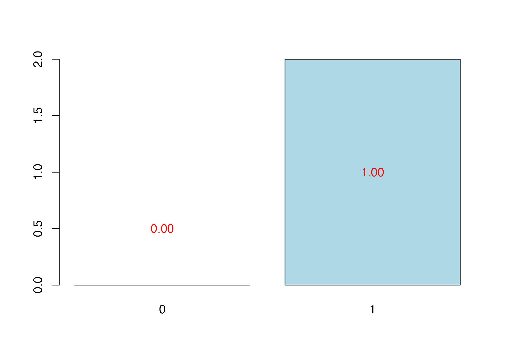
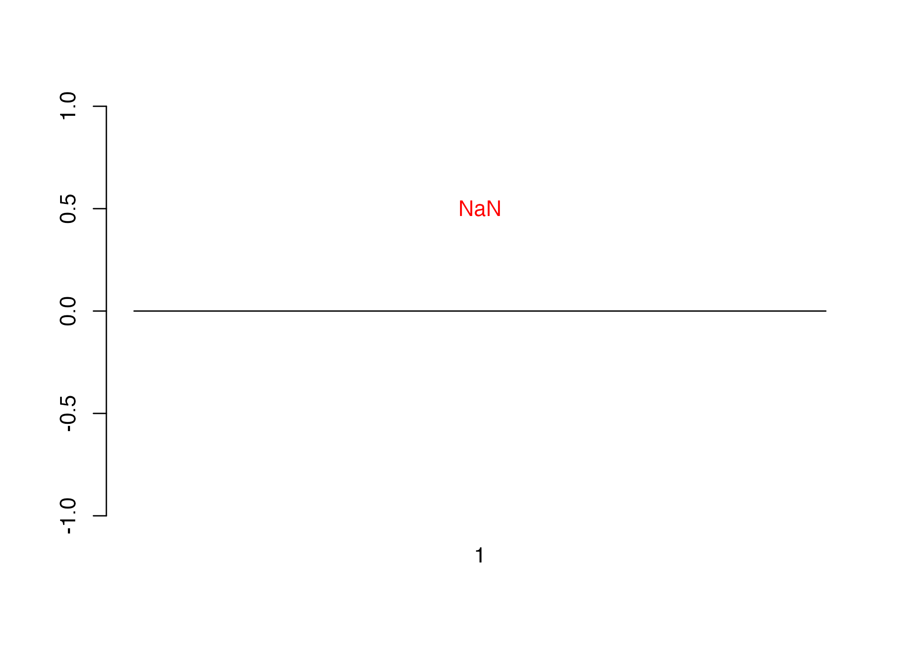

# Getting Started with plsRglm

`plsRglm` provides partial least squares regression for linear and
generalized linear models, repeated k-fold cross-validation, bootstrap
utilities, and support for incomplete predictor matrices. This vignette
is the practical starting point for the current package API. The
companion vignette
[`vignette("plsRglm", package = "plsRglm")`](https://fbertran.github.io/plsRglm/articles/plsRglm.md)
keeps the longer historical case studies and algorithmic notes.

## Core Fitting Workflows

[`plsR()`](https://fbertran.github.io/plsRglm/reference/plsR.md) is the
dedicated interface for ordinary PLS regression.
[`plsRglm()`](https://fbertran.github.io/plsRglm/reference/plsRglm.md)
extends the same ideas to generalized linear and ordinal models, and can
also fit `modele = "pls"` through the shared interface.

### Linear PLS with matrix and formula interfaces

``` r
data(Cornell)
XCornell <- Cornell[, 1:7]
yCornell <- Cornell$Y

pls_fit_matrix <- plsR(yCornell, XCornell, nt = 3, verbose = FALSE)
pls_fit_formula <- plsR(Y ~ ., data = Cornell, nt = 3, pvals.expli = TRUE, verbose = FALSE)

pls_fit_formula$InfCrit
#>                AIC      RSS_Y      R2_Y R2_residY RSS_residY    AIC.std
#> Nb_Comp_0 82.01205 467.796667        NA        NA 11.0000000  37.010388
#> Nb_Comp_1 53.15173  35.742486 0.9235940 0.9235940  0.8404663   8.150064
#> Nb_Comp_2 41.08283  11.066606 0.9763431 0.9763431  0.2602256  -3.918831
#> Nb_Comp_3 32.06411   4.418081 0.9905556 0.9905556  0.1038889 -12.937550
#>            DoF.dof sigmahat.dof    AIC.dof    BIC.dof GMDL.dof DoF.naive
#> Nb_Comp_0 1.000000    6.5212706 46.0708838 47.7893514 27.59461         1
#> Nb_Comp_1 2.740749    1.8665281  4.5699686  4.9558156 21.34020         2
#> Nb_Comp_2 5.085967    1.1825195  2.1075461  2.3949331 27.40202         3
#> Nb_Comp_3 5.121086    0.7488308  0.8467795  0.9628191 24.40842         4
#>           sigmahat.naive  AIC.naive  BIC.naive GMDL.naive
#> Nb_Comp_0      6.5212706 46.0708838 47.7893514   27.59461
#> Nb_Comp_1      1.8905683  4.1699567  4.4588195   18.37545
#> Nb_Comp_2      1.1088836  1.5370286  1.6860917   17.71117
#> Nb_Comp_3      0.7431421  0.7363469  0.8256118   19.01033
coef(pls_fit_formula)
#> Coefficients of the components
#> Coeff_Comp_Reg1 Coeff_Comp_Reg2 Coeff_Comp_Reg3 
#>       0.4820365       0.2731127       0.1030689 
#> Coefficients of the predictors (original scale)
#>                 [,1]
#> Intercept  92.675989
#> X1         -9.828318
#> X2         -6.960181
#> X3        -16.666239
#> X4         -8.421802
#> X5         -4.388934
#> X6         10.161304
#> X7        -34.528959
```

The fitted model stores the extracted components (`tt`), the loadings
(`pp`), the coefficients on the original predictors (`Coeffs`), and
information-criterion summaries (`InfCrit`).

### Generalized PLS models

``` r
data(aze_compl)
logit_fit <- plsRglm(y ~ ., data = aze_compl, nt = 3, modele = "pls-glm-logistic", verbose = FALSE)

logit_fit$InfCrit
#>                AIC      BIC Missclassed Chi2_Pearson_Y    RSS_Y      R2_Y
#> Nb_Comp_0 145.8283 148.4727          49      104.00000 25.91346        NA
#> Nb_Comp_1 118.1398 123.4285          28      100.53823 19.32272 0.2543365
#> Nb_Comp_2 109.9553 117.8885          26       99.17955 17.33735 0.3309519
#> Nb_Comp_3 105.1591 115.7366          22      123.37836 15.58198 0.3986915
#>            R2_residY RSS_residY
#> Nb_Comp_0         NA   25.91346
#> Nb_Comp_1  -6.004879  181.52066
#> Nb_Comp_2  -9.617595  275.13865
#> Nb_Comp_3 -12.332217  345.48389
head(predict(logit_fit, type = "response"))
#>           1           2           3           4           5           6 
#> 0.631858261 0.166440274 0.006791838 0.414180215 0.022736369 0.030654567

family_fit <- plsRglm(
  Y ~ .,
  data = Cornell,
  nt = 2,
  modele = "pls-glm-family",
  family = gaussian(link = "log"),
  verbose = FALSE
)

family_fit$family$family
#> [1] "gaussian"
family_fit$family$link
#> [1] "log"
```

[`plsRglm()`](https://fbertran.github.io/plsRglm/reference/plsRglm.md)
supports predefined model shortcuts together with a custom-family entry
point:

``` r
plsRglm(Y ~ ., data = Cornell, nt = 3, modele = "pls")
plsRglm(Y ~ ., data = Cornell, nt = 3, modele = "pls-glm-gaussian")
plsRglm(Y ~ ., data = Cornell, nt = 3, modele = "pls-glm-inverse.gaussian")
plsRglm(y ~ ., data = aze_compl, nt = 3, modele = "pls-glm-logistic")
data(pine)
plsRglm(round(x11) ~ ., data = pine, nt = 3, modele = "pls-glm-poisson")
plsRglm(x11 ~ ., data = pine, nt = 3, modele = "pls-glm-Gamma")
plsRglm(Quality ~ ., data = bordeaux, nt = 2, modele = "pls-glm-polr")
plsRglm(
  Y ~ .,
  data = Cornell,
  nt = 3,
  modele = "pls-glm-family",
  family = gaussian(link = "log")
)
```

Ordinal responses are handled through `modele = "pls-glm-polr"`. As with
[`MASS::polr()`](https://rdrr.io/pkg/MASS/man/polr.html), the response
should be an ordered factor:

``` r
data(bordeaux)
bordeaux$Quality <- factor(bordeaux$Quality, ordered = TRUE)
polr_fit <- plsRglm(Quality ~ ., data = bordeaux, nt = 2, modele = "pls-glm-polr", verbose = FALSE)

head(predict(polr_fit, type = "class"))
#> [1] 3 3 3 3 1 1
#> Levels: 1 2 3
```

## Cross-Validation and Model Choice

Use
[`cv.plsR()`](https://fbertran.github.io/plsRglm/reference/cv.plsR.md)
for ordinary PLS regression and
[`cv.plsRglm()`](https://fbertran.github.io/plsRglm/reference/cv.plsRglm.md)
for generalized models. Both provide repeated k-fold cross-validation
and integrate with [`summary()`](https://rdrr.io/r/base/summary.html)
and
[`cvtable()`](https://fbertran.github.io/plsRglm/reference/cvtable.md).

``` r
cv_pls <- cv.plsR(Y ~ ., data = Cornell, nt = 3, K = 4, NK = 2, verbose = FALSE)
cv_pls_summary <- cvtable(summary(cv_pls))
#> ____************************************************____
#> ____Component____ 1 ____
#> ____Component____ 2 ____
#> ____Component____ 3 ____
#> ____Predicting X without NA neither in X nor in Y____
#> ****________________________________________________****
#> 
#> 
#> NK: 1,  2
#> 
#> CV Q2 criterion:
#> 0 1 
#> 0 2 
#> 
#> CV Press criterion:
#> 1 2 3 
#> 1 0 1

cv_pls_summary
#> $CVQ2
#> 
#> 0 1 
#> 0 2 
#> 
#> $CVPress
#> 
#> 1 2 3 
#> 1 0 1 
#> 
#> attr(,"class")
#> [1] "table.summary.cv.plsRmodel"
plot(cv_pls_summary)
```



``` r
cv_logit <- cv.plsRglm(
  y ~ .,
  data = aze_compl,
  nt = 3,
  K = 4,
  NK = 2,
  modele = "pls-glm-logistic",
  verbose = FALSE
)
cv_logit_summary <- cvtable(summary(cv_logit, MClassed = TRUE))
#> ____************************************************____
#> 
#> Family: binomial 
#> Link function: logit 
#> 
#> ____Component____ 1 ____
#> ____Component____ 2 ____
#> ____Component____ 3 ____
#> ____Predicting X without NA neither in X or Y____
#> ****________________________________________________****
#> 
#> 
#> NK: 1,  2
#> 
#> CV MissClassed criterion:
#> 1 
#> 0 
#> 
#> CV Q2Chi2 criterion:
#> 0 
#> 0 
#> 
#> CV PreChi2 criterion:
#> 1 
#> 0

cv_logit_summary
#> $CVMC
#> 
#> 1 
#> 0 
#> 
#> $CVQ2Chi2
#> 
#> 0 
#> 0 
#> 
#> $CVPreChi2
#> 
#> 1 
#> 0 
#> 
#> attr(,"class")
#> [1] "table.summary.cv.plsRglmmodel"
plot(cv_logit_summary)
```



For generalized models, `summary(..., MClassed = TRUE)` exposes
miss-classification information when it is relevant.

## Prediction and Missing Data

Incomplete predictor matrices are a core package feature, both during
fitting and during prediction.

``` r
data(pine)
data(pine_sup)
data(pineNAX21)

pred_fit <- plsRglm(
  x11 ~ .,
  data = pine,
  nt = 3,
  modele = "pls-glm-family",
  family = gaussian(),
  verbose = FALSE
)

pine_sup_small <- pine_sup[1:3, 1:10]
pine_sup_small[1, 1] <- NA

predict(pred_fit, newdata = pine_sup_small, type = "response", methodNA = "missingdata")
#> Prediction as if missing values in every row.
#> [1] 1.069831 1.044208 1.099871
predict(pred_fit, newdata = pine_sup_small, type = "scores", methodNA = "missingdata")
#> Prediction as if missing values in every row.
#>          Comp_1     Comp_2      Comp_3
#> [1,] -1.6372897  1.6379888 -0.70670174
#> [2,]  2.7246680 -0.9524725  0.08931408
#> [3,]  0.2109157  0.1437880  0.60713672

missing_train_fit <- plsR(x11 ~ ., data = pineNAX21, nt = 3, verbose = FALSE)
missing_train_fit$na.miss.X
#> [1] TRUE
```

When `newdata` contains incomplete rows, `methodNA = "missingdata"`
treats all prediction rows with the missing-data scoring rule, while
`methodNA = "adaptative"` switches between complete-row and
incomplete-row formulas automatically.

## Bootstrap Utilities

[`bootpls()`](https://fbertran.github.io/plsRglm/reference/bootpls.md)
and
[`bootplsglm()`](https://fbertran.github.io/plsRglm/reference/bootplsglm.md)
wrap the `boot` package for PLS and PLS-GLM models. The default
resampling schemes differ:

- [`bootpls()`](https://fbertran.github.io/plsRglm/reference/bootpls.md)
  defaults to `(y, X)` resampling with `typeboot = "plsmodel"`.
- [`bootplsglm()`](https://fbertran.github.io/plsRglm/reference/bootplsglm.md)
  defaults to `(y, T)` resampling with `typeboot = "fmodel_np"`.

For a lightweight vignette render, the examples below use a small number
of resamples and request non-BCa confidence intervals.

``` r
boot_pls <- bootpls(pls_fit_formula, R = 20, verbose = FALSE)
dim(boot_pls$t)
#> [1] 20  8
confints.bootpls(boot_pls, indices = 2:4, typeBCa = FALSE)
#>                                                                        
#> X1 -0.2475717 -0.03327075 -0.2245013 -0.02750589 -0.2506774 -0.05368204
#> X2 -0.3536188 -0.13085016 -0.3745613 -0.16541114 -0.2519763 -0.04282623
#> X3 -0.2439306 -0.03274124 -0.2214286 -0.02580527 -0.2493054 -0.05368204
#> attr(,"typeBCa")
#> [1] FALSE

boot_logit <- bootplsglm(logit_fit, R = 20, verbose = FALSE)
dim(boot_logit$t)
#> [1] 20 33
confints.bootpls(boot_logit, indices = 1:4, typeBCa = FALSE)
#>                                                                                
#> D2S138  -0.06589283 -0.008551969 -0.06363197 -0.01614121 -0.06403926 -0.0165485
#> D18S61   0.05549884  0.211389097  0.05344981  0.21637898  0.06378505  0.2267142
#> D16S422 -0.05412552 -0.010392387 -0.05157091 -0.01447845 -0.05425966 -0.0171672
#> D17S794  0.02916771  0.100612731  0.02988348  0.10029296  0.03541179  0.1058213
#> attr(,"typeBCa")
#> [1] FALSE
```

The plotting helpers
[`boxplots.bootpls()`](https://fbertran.github.io/plsRglm/reference/boxplots.bootpls.md)
and
[`plots.confints.bootpls()`](https://fbertran.github.io/plsRglm/reference/plots.confints.bootpls.md)
can be applied directly to these bootstrap objects when a graphical
summary is helpful.

## Further Reading

- Use
  [`vignette("plsRglm", package = "plsRglm")`](https://fbertran.github.io/plsRglm/articles/plsRglm.md)
  for the historical applications and algorithmic note.
- Use the function help pages for lower-level weighted constructors such
  as
  [`PLS_lm_wvc()`](https://fbertran.github.io/plsRglm/reference/PLS_lm_wvc.md)
  and
  [`PLS_glm_wvc()`](https://fbertran.github.io/plsRglm/reference/PLS_glm_wvc.md).
- Use
  [`?cv.plsRglm`](https://fbertran.github.io/plsRglm/reference/cv.plsRglm.md),
  [`?bootplsglm`](https://fbertran.github.io/plsRglm/reference/bootplsglm.md),
  and
  [`?predict.plsRglmmodel`](https://fbertran.github.io/plsRglm/reference/predict.plsRglmmodel.md)
  for the full argument reference.

``` r
sessionInfo()
#> R version 4.5.2 (2025-10-31)
#> Platform: aarch64-apple-darwin20
#> Running under: macOS Sonoma 14.7.1
#> 
#> Matrix products: default
#> BLAS:   /System/Library/Frameworks/Accelerate.framework/Versions/A/Frameworks/vecLib.framework/Versions/A/libBLAS.dylib 
#> LAPACK: /Library/Frameworks/R.framework/Versions/4.5-arm64/Resources/lib/libRlapack.dylib;  LAPACK version 3.12.1
#> 
#> locale:
#> [1] en_US.UTF-8/en_US.UTF-8/en_US.UTF-8/C/en_US.UTF-8/en_US.UTF-8
#> 
#> time zone: Europe/Paris
#> tzcode source: internal
#> 
#> attached base packages:
#> [1] stats     graphics  grDevices utils     datasets  methods   base     
#> 
#> other attached packages:
#> [1] plsRglm_1.7.0
#> 
#> loaded via a namespace (and not attached):
#>  [1] sass_0.4.10           lattice_0.22-7        digest_0.6.39        
#>  [4] magrittr_2.0.4        statnet.common_4.13.0 evaluate_1.0.5       
#>  [7] grid_4.5.2            RColorBrewer_1.1-3    mvtnorm_1.3-3        
#> [10] fastmap_1.2.0         maps_3.4.3            jsonlite_2.0.0       
#> [13] Matrix_1.7-4          network_1.20.0        Formula_1.2-5        
#> [16] mgcv_1.9-3            bipartite_2.23        spam_2.11-3          
#> [19] viridisLite_0.4.3     permute_0.9-10        textshaping_1.0.4    
#> [22] jquerylib_0.1.4       abind_1.4-8           cli_3.6.5            
#> [25] rlang_1.1.7           splines_4.5.2         cachem_1.1.0         
#> [28] yaml_2.3.12           otel_0.2.0            vegan_2.7-2          
#> [31] plsdof_0.4-0          tools_4.5.2           parallel_4.5.2       
#> [34] coda_0.19-4.1         boot_1.3-32           vctrs_0.7.1          
#> [37] R6_2.6.1              lifecycle_1.0.5       car_3.1-5            
#> [40] fs_1.6.6              htmlwidgets_1.6.4     MASS_7.3-65          
#> [43] ragg_1.5.0            cluster_2.1.8.2       pkgconfig_2.0.3      
#> [46] sna_2.8               desc_1.4.3            pkgdown_2.2.0        
#> [49] bslib_0.10.0          pillar_1.11.1         glue_1.8.0           
#> [52] Rcpp_1.1.1            fields_17.1           systemfonts_1.3.1    
#> [55] xfun_0.56             tibble_3.3.1          rstudioapi_0.18.0    
#> [58] knitr_1.51            htmltools_0.5.9       nlme_3.1-168         
#> [61] igraph_2.2.2          carData_3.0-6         rmarkdown_2.30       
#> [64] dotCall64_1.2         compiler_4.5.2
```
